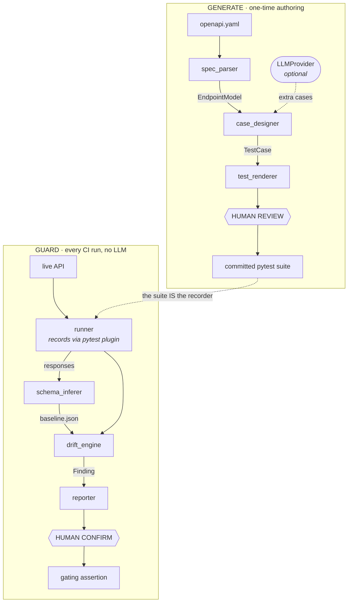

# SpecGuard

[](https://github.com/athrvrne/specguard/actions/workflows/ci.yml)

**Generate from spec, guard against drift.**

Point SpecGuard at an OpenAPI spec and it writes you a review-ready pytest
suite. Point it at a running API and it records what the responses actually look
like, then tells you when that quietly changes.

> ⚠️ **Status: in development.** Both halves work end to end — `generate`,
> `baseline`, `guard`, and a bundled `demo` API to try them against. Polish and
> packaging remain (see [Roadmap](#roadmap)). Not on PyPI yet.

---

## The problem

API tests rot in two directions at once.

Writing them by hand is slow and uneven — under deadline pressure people cover
the happy path and skip the negative, boundary, and auth cases. Then, once tests
exist, the API moves underneath them. A field goes nullable. A type changes. An
enum gains a value. **The tests still pass**, because they only assert what
somebody happened to think of at the time. Contract drift reaches your consumers
before anyone notices.

Most tools attack one half. SpecGuard attacks both, and keeps the AI in a
narrow, reviewable role so you can actually trust the output.

---

## How it works

Two pipelines over shared infrastructure. They're independent — generate without
ever guarding, or guard a hand-written suite without generating.



**Generate** is a one-time authoring step. **Guard** runs on every build and
never calls a model.

That dotted line is the load-bearing part. Baselining needs *real* request
data — a real order id, a real auth token — and a spec supplies neither.
SpecGuard doesn't invent them: it records while your existing suite runs, because
that suite has real ids in it already. A human made it pass. Recording hooks
`requests.Session.send` from a plugin loaded with `-p specguard.record`, so it
works on hand-written suites too, and generated tests still import nothing from
SpecGuard.

---

## The design principle everything else follows from

> **The AI is narrow and reviewable, never silent authority over pass/fail.**

An AI component that is confidently wrong and hides a real failure is worse than
no tool at all. So:

- **The deterministic core does everything that gates or asserts.** Spec parsing,
  case design, schema inference, the diff engine, severity classification, and
  the renderer are all reproducible and unit-tested with no model in the loop.
- **The LLM has exactly one job today**, and it is additive: propose *extra* test
  cases inferred from natural-language field descriptions a JSON Schema can't
  encode ("must not be blank", "must be a future date"). Every failure mode —
  no provider, connection refused, HTTP 500, a refusal in prose, truncated
  JSON — returns zero extra cases rather than raising. (Prose explanations of a
  drift finding are designed but not built.)
- **Generated tests are a draft.** They land in `generated/`, flagged for review,
  never auto-committed. Anything SpecGuard had to guess is marked `# REVIEW:`
  with the reason.
- **There is always a deterministic floor.** Turn the LLM off and you still get
  a solid suite; Guard works fully either way.

How little is non-deterministic, concretely:

| Module | Job | Deterministic? |
|---|---|:--:|
| `spec_parser` | OpenAPI 3.x → `EndpointModel` | ✅ |
| `models` | `EndpointModel`, `TestCase`, `Finding` | ✅ |
| `case_designer` | `EndpointModel` → `TestCase` list | ✅ core, LLM adds extras |
| `test_renderer` | `TestCase` list → pytest source | ✅ |
| `runner` | Record real responses while a suite runs | ✅ |
| `record` | The pytest plugin that does the recording | ✅ |
| `schema_inferer` | Responses → inferred schema + value stats | ✅ |
| `baseline_store` | Read/write `baseline.json` | ✅ |
| `drift_engine` | `diff(baseline, current)` → findings | ✅ |
| `reporter` | Findings → JSON / console / JUnit | ✅ |
| `demo_api` | A breakable API to try it against | ✅ |
| `cli` | Command surface, wiring | ✅ |
| `llm/parsing` | Model reply → validated cases | ✅ |
| `llm/claude`, `llm/ollama` | The only calls that leave the machine | ❌ *isolated* |

Two files are non-deterministic, both behind one `complete()` method, and
**nothing in the Guard half imports them.**

---

## Quick start

```bash
git clone https://github.com/athrvrne/specguard && cd specguard
python3 -m venv .venv && .venv/bin/pip install -e ".[dev]"
```

Generate a suite from the bundled spec:

```bash
.venv/bin/specguard generate examples/petstore.yaml --out generated/
```

```
Parsed 4 endpoints from examples/petstore.yaml
Wrote 20 cases to generated/
  test_pets.py
  conftest.py
  schemas.py
  README.md

2 case(s) marked REVIEW — SpecGuard invented data the spec did not supply:
  test_show_pet_by_id_happy_path: path parameter(s) petId were invented — the
  spec gives no example, so this will 404 until a real value is supplied
  test_delete_pet_happy_path: path parameter(s) petId were invented — ...

This is a draft. Read it, fix the REVIEW cases, then move what you want into
your real suite.
```

Run it against your API:

```bash
SPECGUARD_BASE_URL=https://api.staging.example.com \
SPECGUARD_AUTH_TOKEN=$TOKEN \
.venv/bin/pytest generated/
```

---

## The demo: catch a renamed field

No network, no Node, nothing to sign up for. SpecGuard ships a small API that
honours the bundled spec — and can be told to break its own contract.

In one terminal:

```bash
.venv/bin/specguard demo --port 8080
```

In another, record what the API returns today:

```bash
.venv/bin/specguard baseline --spec examples/petstore.yaml --suite generated/ \
                             --base-url http://127.0.0.1:8080 --auth-token t
```

```
Recorded 4 endpoints to baseline.json
  not guarded: DELETE /pets/{petId} returned no JSON body to record (statuses seen: 204)
  low confidence: GET /pets rests on 3 response(s); fields seen once are recorded as required and may cause false drift
  low confidence: GET /pets/{petId} rests on 1 response(s); ...
  low confidence: POST /pets rests on 3 response(s); ...
```

Now restart the demo as if someone shipped a rename, and guard:

```bash
.venv/bin/specguard demo --port 8080 --rename name:pet_name
```

```bash
.venv/bin/specguard guard --spec examples/petstore.yaml --suite generated/ \
                          --base-url http://127.0.0.1:8080 --auth-token t
```

```
nothing recorded in the baseline, so not checked: DELETE /pets/{petId}
2 breaking, 0 warning, 3 info

  [x] breaking GET /pets
      [].name: was required in baseline, absent in current response
  [x] breaking GET /pets/{petId}
      name: was required in baseline, absent in current response
  [i] info     GET /pets
      [].pet_name: new optional field; consider adding it to the baseline
  [i] info     GET /pets/{petId}
      pet_name: new optional field; consider adding it to the baseline
  [i] info     POST /pets
      pet_name: new optional field; consider adding it to the baseline

Report written to drift_report.json

FAIL: 2 breaking, 0 warning (--fail-on breaking)
```

Exit code 1, the exact field named, nested paths addressed (`[].name` is the
field inside the array items). `--rename` is the breaking case; `--add` gives you
an informational one, and `--lax` makes the API stop validating input — drift no
schema diff can catch, but the generated validation tests do.

To point it at *your* spec instead, [Prism](https://github.com/stoplightio/prism)
(`npx @stoplight/prism-cli mock your-spec.yaml`) serves any OpenAPI file.

---

## What the output looks like

Plain pytest over `requests`. Readable, editable, and **it does not import
SpecGuard** — uninstall the tool and your suite keeps working.

```python
@pytest.mark.happy
def test_list_pets_happy_path(api):
    response = api.request(
        "GET",
        '/pets',
        params={'status': 'available'},
    )
    assert response.status_code == 200
    validate(instance=response.json(), schema=LISTPETS_RESPONSE)


# REVIEW: path parameter(s) petId were invented — the spec gives no example,
# so this will 404 until a real value is supplied
@pytest.mark.happy
def test_show_pet_by_id_happy_path(api):
    response = api.request(
        "GET",
        '/pets/string',
    )
    assert response.status_code == 200
    validate(instance=response.json(), schema=SHOWPETBYID_RESPONSE)
```

That second test is the honest part. A spec can describe the *shape* of
`GET /pets/{petId}` but not a real pet id, so SpecGuard invents one, says so,
and marks it. Silently shipping a test that 404s would be worse.

### The case matrix

Every endpoint gets, deterministically:

| Marker | What it covers |
|---|---|
| `happy` | The documented success path, with a response-schema assertion |
| `validation` | Each required field dropped; each field sent with the wrong type |
| `boundary` | Each declared `min`/`max` probed at the edge **and one step past it** |
| `auth` | The same request with no credentials |
| `llm_extra` | Proposed by a model from a field's prose description |

Run one kind at a time: `pytest -m boundary`.

Expected status codes come from the spec, not from assumptions — an API that
documents `400` for validation errors gets `400`, not a hardcoded `422`.

### The optional model

The first four rows above need no model at all. `--provider` adds the fifth:

```bash
specguard generate openapi.yaml --provider claude   # or ollama, or none (default)
```

The model reads only the prose notes on request-body fields — the things a
schema cannot express — and proposes cases for them:

```python
# REVIEW: description says the name must not be blank
@pytest.mark.specguard_llm
@pytest.mark.llm_extra
def test_create_pet_llm_1_blank_name_rejected(api):
    response = api.request(
        "POST",
        '/pets',
        json={'name': '   ', 'status': 'available'},
    )
    assert response.status_code == 422
```

`minLength: 1` would pass that payload. A human reading "must not be blank"
would not. That gap is the entire remit.

Parsing the reply is the part that gets tested, and **the rule is drop, never
guess.** A case SpecGuard cannot read is discarded rather than
half-reconstructed — the floor already stands alone, so losing a suggestion
costs nothing, while inventing one puts an unreviewable test in front of someone
who trusts the tool. A case with no stated `reason` is dropped for the same
reason: the reason is what you read to approve or delete it.

Measured against a server returning each failure mode in turn:

| Provider reply | Exit | Tests generated | Extras |
|---|:--:|:--:|:--:|
| well-formed (prose + markdown fence) | 0 | 22 | 2 |
| refusal in prose | 0 | 20 | 0 |
| truncated mid-array | 0 | 20 | 0 |
| case with no `reason` | 0 | 20 | 0 |
| HTTP 500 | 0 | 20 | 0 |

Twenty every time. Defaults are `claude-opus-5` and `qwen2.5-coder`; override
with `--model`. The Claude provider needs `pip install 'specguard[claude]'` and
`ANTHROPIC_API_KEY`; Ollama needs neither and keeps your spec on your machine.

### What gets scaffolded

```
generated/
  test_pets.py     # regenerated every run — don't edit
  conftest.py      # written ONCE — the api fixture, yours to edit
  schemas.py       # written ONCE — response schemas lifted from the spec
  README.md        # written ONCE — how to review this draft
```

Only test modules are overwritten. Edit `conftest.py` and regenerate freely:
SpecGuard will not touch it again.

If your team has its own conventions — httpx instead of requests, async tests,
an in-house client wrapper — point `--template-dir` at your own Jinja templates.
Override only the ones you care about; the rest fall back to the built-ins, so
an override never has to be a full copy that then rots.

---

## Data models

Three artifacts, all plain JSON so they diff cleanly in Git.

**`baseline.json`** — the recorded contract, per endpoint:

```json
{
  "endpoints": {
    "GET /v1/orders/{id}": {
      "success_status": 200,
      "inferred_schema": {
        "type": "object",
        "required": ["id", "amount", "currency", "status"],
        "properties": {
          "status": {"type": "string", "enum": ["created", "paid", "void"]}
        }
      },
      "value_stats": {"amount": {"min": 1.0, "max": 999999.0, "nullable": false}}
    }
  }
}
```

**`drift_report.json`** — the output of guard mode:

```json
{
  "findings": [
    {"endpoint": "GET /v1/orders/{id}", "severity": "breaking",
     "kind": "field_removed", "field": "customer.address.postcode",
     "detail": "was required in baseline, absent in current response"}
  ],
  "summary": {"breaking": 1, "warning": 0, "info": 0}
}
```

`field` is a **dotted path**, so drift in a nested object is addressable rather
than ambiguous.

### Severity is code, not judgment

| `kind` | Severity | |
|---|---|---|
| `field_removed` (was required) | 🔴 **breaking** | consumers read a field that's gone |
| `field_no_longer_required` | 🔴 **breaking** | it's now missing from some responses |
| `type_changed` | 🔴 **breaking** | `number` → `string` breaks parsing |
| `enum_removed` | 🔴 **breaking** | consumers may still send the dropped value |
| `enum_added` | 🟡 **warning** | a value nobody's `switch` handles |
| `type_widened` | 🟡 **warning** | still returns the old type, plus another |
| `field_added` | 🔵 **info** | additive; nothing breaks |
| `field_removed` (was optional) | 🔵 **info** | nobody could rely on it |

These live in `drift_engine` as plain Python, so the same drift always gets the
same severity. A renamed field surfaces as a **breaking** removal plus an
**info** addition — the tool reports what it observed rather than guessing at
intent. A container swapping shape (object ↔ array) is reported once and the
walk stops, instead of emitting noise for every field beneath it.

### Guarding against false drift

An inferred schema that is too strict fires drift on every run and trains people
to ignore the tool — worse than missing a change. So inference is deliberately
conservative:

- **Sample size is recorded, not assumed.** Below 20 observations an endpoint is
  flagged `low confidence` in the output rather than presented as fact.
- **A string becomes an `enum` only on real evidence**: ≤ 10 distinct values,
  distinct/sample ≤ 0.2, and ≥ 20 samples. Free text stays a string.
- **One call returning 30 list items counts as 30 observations**, not one —
  which is what makes collection endpoints cheap to baseline. Singleton
  endpoints degrade honestly instead of pretending.
- **Nesting is real.** Inference and diffing both recurse through objects and
  arrays, and findings carry dotted paths (`[].name`,
  `customer.address.postcode`).

The failure mode that matters here is silence, so it is reported everywhere:
endpoints the suite never exercised, endpoints that returned no JSON body, and
endpoints with nothing in the baseline are each named rather than passing
quietly as clean.

---

## CLI

```bash
# generate a reviewable suite from a spec
specguard generate openapi.yaml --out generated/ --base-url https://api.example.com

# ...with a model proposing extra cases on top of the deterministic floor
specguard generate openapi.yaml --out generated/ --provider claude

# record current responses as the contract baseline
specguard baseline --spec openapi.yaml --suite generated/ \
                   --base-url https://api.staging.example.com \
                   --auth-token $TOKEN --out baseline.json

# compare live responses to the baseline; nonzero exit on breaking drift
specguard guard --spec openapi.yaml --suite generated/ \
                --base-url https://api.staging.example.com \
                --auth-token $TOKEN \
                --baseline baseline.json --report drift.json \
                --junitxml drift.xml --fail-on breaking

# run a suite with the base URL and credentials already wired up
specguard run generated/ --base-url https://api.staging.example.com \
                         --auth-token $TOKEN --junitxml results.xml -- -m boundary

# a breakable API to try all of the above against
specguard demo --port 8080 [--rename name:pet_name | --add seen_at | --lax]
```

`run` is deliberately thin: it is `pytest` with the environment the scaffolded
`conftest.py` looks for, so a suite that passes under `run` behaves identically
when `baseline` and `guard` drive it. Anything it doesn't recognise is handed
straight through to pytest.

`baseline` and `guard` both take `--suite`, because they drive *your* tests to
produce the traffic they record. `--auth-token` matters more than it looks:
without credentials a protected endpoint returns 401, records nothing, and is
**silently unguarded** — so SpecGuard names every endpoint it could not check
rather than counting it clean.

`--fail-on` is how you keep control of the gate. `--fail-on breaking` blocks a
removed required field but lets a new enum value through as a warning. The tool
never decides on its own to fail your build on an ambiguous change.

```yaml
- name: Guard against API drift
  run: |
    specguard guard --spec openapi.yaml --suite tests/api/ \
                    --base-url ${{ env.STAGING_URL }} \
                    --auth-token ${{ secrets.STAGING_TOKEN }} \
                    --baseline baseline.json --report drift.json \
                    --junitxml drift.xml --fail-on breaking

- name: Publish drift report
  if: always()
  uses: actions/upload-artifact@v4
  with: { name: drift-report, path: drift.json }
```

JUnit output reports *every* finding as a test case so CI shows the full
picture, but only those at or above `--fail-on` are marked as failures.

---

## Roadmap

- [x] **M1** — OpenAPI parsing → `EndpointModel` (no LLM)
- [x] **M2** — Generate half: spec → runnable pytest suite, deterministic floor
      plus optional model-proposed extras
- [x] **M3** — Guard half: `baseline` + drift detection with fixed severities,
      JUnit output, and a bundled demo API
- [x] **M4** — `run` command, `--template-dir`, CI on Python 3.10–3.13
- [ ] **M5** — published to PyPI

Known gaps, stated plainly:

- **A thin baseline under-reports.** If an endpoint was seen 3 times, a field
  that happened to appear in all 3 is recorded as required — but one seen twice
  is not, so losing it later registers as `info` rather than `breaking`. The
  `low confidence` warning fires correctly; the severity is still generous.
- **Local `$ref`s only.** Remote (`http://`) refs and non-JSON media types are
  skipped rather than raising.

Post-v1: value-anomaly detection (a price that jumped 100×), GraphQL via
introspection, drift history dashboard, MCP server.

---

## Developing

```bash
python3 -m venv .venv && .venv/bin/pip install -e ".[dev]"
.venv/bin/pytest
```

Requires Python 3.10+, tested on 3.10 through 3.13 plus macOS in CI. **223
tests, none of which call a live model or reach the network.**

The suite includes two **end-to-end acceptance tests**, both built on the same
idea — a test that only ever passes proves nothing:

- **Generate:** produce a suite from `examples/petstore.yaml`, serve an API that
  honours that spec, run the generated tests against it. Then break the API's
  validation and assert the suite goes red.
- **Guard:** baseline a live API, rename a required field, and assert exactly
  the two breaking findings at `name` and `[].name`.

How SpecGuard is tested, by module type:

- **Deterministic modules** — golden outputs against a fixed example spec.
- **The renderer** — snapshot tests; the same `TestCase` list must produce
  byte-identical pytest. A test AST-parses the output and pins the import set,
  so the suite can never quietly start depending on SpecGuard.
- **The LLM module** — tests cover *parsing of model output* (prose preambles,
  markdown fences, truncation, refusals, wrapper objects) from recorded
  fixtures, plus both providers against a fake transport that pins the request
  shape. No test calls a live model or needs an API key.

---

## Stack

Python · pytest · Jinja2 · jsonschema · click · requests · PyYAML ·
Claude API or Ollama.

## License

MIT — see [LICENSE](LICENSE).

---

*Built by [Atharva Rane](https://github.com/athrvrne) — author of
[pytest-self-healer](https://pypi.org/project/pytest-self-healer).*
