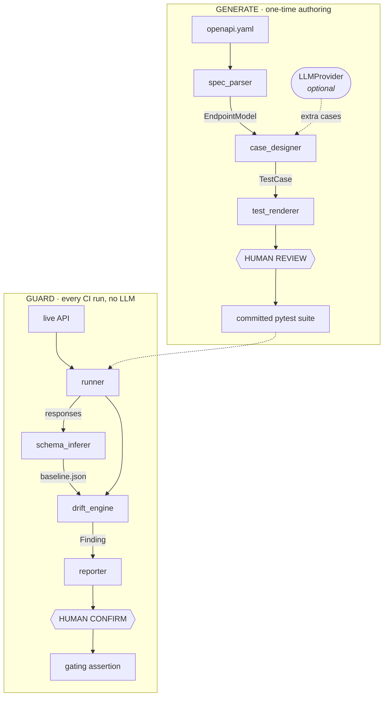

# SpecGuard

**Generate from spec, guard against drift.**

Point SpecGuard at an OpenAPI spec and it writes you a review-ready pytest
suite. Point it at a running API and it records what the responses actually look
like, then tells you when that quietly changes.

> ⚠️ **Status: in development.** The Generate half works end to end (see
> [Roadmap](#roadmap)). The Guard half is not built yet. Not on PyPI.

---

## The problem

API tests rot in two directions at once.

Writing them by hand is slow and uneven — under deadline pressure people cover
the happy path and skip the negative, boundary, and auth cases. Then, once tests
exist, the API moves underneath them. A field goes nullable. A type changes. An
enum gains a value. **The tests still pass**, because they only assert what
somebody happened to think of at the time. Contract drift reaches your consumers
before anyone notices.

Most tools attack one half. SpecGuard attacks both, and keeps the AI in a
narrow, reviewable role so you can actually trust the output.

---

## How it works

Two pipelines over shared infrastructure. They're independent — generate without
ever guarding, or guard a hand-written suite without generating.



**Generate** is a one-time authoring step. **Guard** runs on every build and
never calls a model.

---

## The design principle everything else follows from

> **The AI is narrow and reviewable, never silent authority over pass/fail.**

An AI component that is confidently wrong and hides a real failure is worse than
no tool at all. So:

- **The deterministic core does everything that gates or asserts.** Spec parsing,
  case design, schema inference, the diff engine, severity classification, and
  the renderer are all reproducible and unit-tested with no model in the loop.
- **The LLM has exactly two jobs**, both additive: propose *extra* test cases
  inferred from natural-language field descriptions a JSON Schema can't encode
  ("must be a future date"), and optionally explain a drift finding in prose.
- **Generated tests are a draft.** They land in `generated/`, flagged for review,
  never auto-committed. Anything SpecGuard had to guess is marked `# REVIEW:`
  with the reason.
- **There is always a deterministic floor.** Turn the LLM off and you still get
  a solid suite; Guard works fully either way.

How little is non-deterministic, concretely:

| Module | Job | Deterministic? |
|---|---|:--:|
| `spec_parser` | OpenAPI 3.x → `EndpointModel` | ✅ |
| `models` | `EndpointModel`, `TestCase`, `Finding` | ✅ |
| `case_designer` | `EndpointModel` → `TestCase` list | ✅ core, LLM adds extras |
| `test_renderer` | `TestCase` list → pytest source | ✅ |
| `cli` | Command surface, wiring | ✅ |
| `llm/` | Provider protocol + Claude/Ollama impls | ❌ *isolated* |
| `runner` | Execute requests, capture responses | ✅ *(planned)* |
| `schema_inferer` | Responses → schema + value stats | ✅ *(planned)* |
| `drift_engine` | `diff(baseline, current)` → findings | ✅ *(planned)* |
| `reporter` | Findings → JSON / console / JUnit | ✅ *(planned)* |

One module is non-deterministic, and nothing depends on it.

---

## Quick start

```bash
git clone https://github.com/athrvrne/specguard && cd specguard
python3 -m venv .venv && .venv/bin/pip install -e ".[dev]"
```

Generate a suite from the bundled spec:

```bash
.venv/bin/specguard generate examples/petstore.yaml --out generated/
```

```
Parsed 4 endpoints from examples/petstore.yaml
Wrote 20 cases to generated/
  test_pets.py
  conftest.py
  schemas.py
  README.md

2 case(s) marked REVIEW — SpecGuard invented data the spec did not supply:
  test_show_pet_by_id_happy_path: path parameter(s) petId were invented — the
  spec gives no example, so this will 404 until a real value is supplied
  test_delete_pet_happy_path: path parameter(s) petId were invented — ...

This is a draft. Read it, fix the REVIEW cases, then move what you want into
your real suite.
```

Run it against your API:

```bash
SPECGUARD_BASE_URL=https://api.staging.example.com \
SPECGUARD_AUTH_TOKEN=$TOKEN \
.venv/bin/pytest generated/
```

---

## What the output looks like

Plain pytest over `requests`. Readable, editable, and **it does not import
SpecGuard** — uninstall the tool and your suite keeps working.

```python
@pytest.mark.happy
def test_list_pets_happy_path(api):
    response = api.request(
        "GET",
        '/pets',
        params={'status': 'available'},
    )
    assert response.status_code == 200
    validate(instance=response.json(), schema=LISTPETS_RESPONSE)


# REVIEW: path parameter(s) petId were invented — the spec gives no example,
# so this will 404 until a real value is supplied
@pytest.mark.happy
def test_show_pet_by_id_happy_path(api):
    response = api.request(
        "GET",
        '/pets/string',
    )
    assert response.status_code == 200
    validate(instance=response.json(), schema=SHOWPETBYID_RESPONSE)
```

That second test is the honest part. A spec can describe the *shape* of
`GET /pets/{petId}` but not a real pet id, so SpecGuard invents one, says so,
and marks it. Silently shipping a test that 404s would be worse.

### The case matrix

Every endpoint gets, deterministically:

| Marker | What it covers |
|---|---|
| `happy` | The documented success path, with a response-schema assertion |
| `validation` | Each required field dropped; each field sent with the wrong type |
| `boundary` | Each declared `min`/`max` probed at the edge **and one step past it** |
| `auth` | The same request with no credentials |
| `llm_extra` | Proposed by a model from a field's prose description |

Run one kind at a time: `pytest -m boundary`.

Expected status codes come from the spec, not from assumptions — an API that
documents `400` for validation errors gets `400`, not a hardcoded `422`.

### What gets scaffolded

```
generated/
  test_pets.py     # regenerated every run — don't edit
  conftest.py      # written ONCE — the api fixture, yours to edit
  schemas.py       # written ONCE — response schemas lifted from the spec
  README.md        # written ONCE — how to review this draft
```

Only test modules are overwritten. Edit `conftest.py` and regenerate freely:
SpecGuard will not touch it again.

---

## Data models

Three artifacts, all plain JSON so they diff cleanly in Git.

**`baseline.json`** — the recorded contract, per endpoint:

```json
{
  "endpoints": {
    "GET /v1/orders/{id}": {
      "success_status": 200,
      "inferred_schema": {
        "type": "object",
        "required": ["id", "amount", "currency", "status"],
        "properties": {
          "status": {"type": "string", "enum": ["created", "paid", "void"]}
        }
      },
      "value_stats": {"amount": {"min": 1.0, "max": 999999.0, "nullable": false}}
    }
  }
}
```

**`drift_report.json`** — the output of guard mode:

```json
{
  "findings": [
    {"endpoint": "GET /v1/orders/{id}", "severity": "breaking",
     "kind": "field_removed", "field": "customer.address.postcode",
     "detail": "was required in baseline, absent in current response"}
  ],
  "summary": {"breaking": 1, "warning": 0, "info": 0}
}
```

`field` is a **dotted path**, so drift in a nested object is addressable rather
than ambiguous.

### Severity is code, not judgment

| Change | Severity |
|---|---|
| Required field removed or renamed; type changed | 🔴 **breaking** |
| New enum value; widened type | 🟡 **warning** |
| New optional field | 🔵 **info** |

These rules live in `drift_engine` as plain Python, so the same drift always
gets the same severity. The LLM may write an explanation on top; it never
assigns the severity.

### Guarding against false drift

Inferred schemas are only as good as the sample. So: baseline from **N ≥ 20**
responses, treat single-observation fields as optional, and only infer an `enum`
when the observed value set is small and stable relative to the sample size —
otherwise leave it a plain string. A free-text field must never become an enum.

---

## Planned CLI

```bash
# generate a reviewable suite from a spec                    [available now]
specguard generate openapi.yaml --out generated/ --base-url https://api.example.com

# ...with a model proposing extra cases on top of the floor  [planned]
specguard generate openapi.yaml --out generated/ --provider claude

# record current responses as the contract baseline          [planned]
specguard baseline --base-url https://api.staging.example.com --out baseline.json

# compare live responses to the baseline                     [planned]
specguard guard --base-url https://api.staging.example.com \
                --baseline baseline.json --report drift.json \
                --fail-on breaking

# run the generated suite and emit JUnit                     [planned]
specguard run generated/ --junitxml results.xml
```

`--fail-on` is how you keep control of the gate. `--fail-on breaking` blocks a
removed required field but lets a new enum value through as a warning. The tool
never decides on its own to fail your build on an ambiguous change.

```yaml
- name: Guard against API drift
  run: specguard guard --base-url ${{ env.STAGING_URL }} \
                       --baseline baseline.json --report drift.json \
                       --fail-on breaking

- name: Publish drift report
  if: always()
  uses: actions/upload-artifact@v4
  with: { name: drift-report, path: drift.json }
```

---

## Roadmap

- [x] **M1** — OpenAPI parsing → `EndpointModel` (no LLM)
- [x] **M2** — Generate half: spec → runnable pytest suite, deterministic floor
- [ ] **M3** — Guard half: `baseline` + drift detection with fixed severities
- [ ] **M4** — `run` command, JUnit output, CI recipes, published to PyPI

Post-v1: value-anomaly detection (a price that jumped 100×), GraphQL via
introspection, drift history dashboard, MCP server.

---

## Developing

```bash
python3 -m venv .venv && .venv/bin/pip install -e ".[dev]"
.venv/bin/pytest
```

Requires Python 3.10+.

The suite includes an **end-to-end acceptance test**: it generates a suite from
`examples/petstore.yaml`, starts a fake API that honours that spec, and runs the
generated tests against it. Then it breaks the API's validation and asserts the
generated suite goes red — because a suite where everything passes proves
nothing.

How SpecGuard is tested, by module type:

- **Deterministic modules** — golden outputs against a fixed example spec.
- **The renderer** — snapshot tests; the same `TestCase` list must produce
  byte-identical pytest.
- **The LLM module** — tests cover *parsing of model output* (malformed JSON,
  extra prose) using recorded fixtures. Tests never call a live model.

---

## Stack

Python · pytest · Jinja2 · jsonschema · click · requests · PyYAML ·
Claude API or Ollama.

## License

MIT — see [LICENSE](LICENSE).

---

*Built by [Atharva Rane](https://github.com/athrvrne) — author of
[pytest-self-healer](https://pypi.org/project/pytest-self-healer).*
